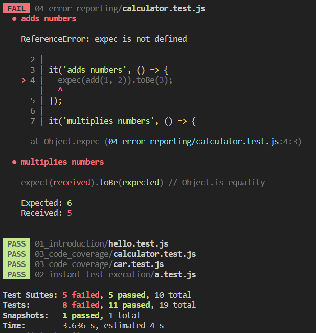

# This repo is made to lern JEST framework

## What is **JEST**?
Jest is the testing framework build by fackbook. It is used to test React App and most commonly javascript with focus of simplicity.

<details><summary>Screenshot of JEST testing:</summary>

<center>
    
</center>

</details>

## Pros of testing approch:
<ol>
<li> FAILING TEST = MOST LIKELY A BUG
<li> Easy to read and understand module / functions
<li> Survives major refactiring
<li> Tests entire app
</ol>

## What is Eslint?
Eslint is the tool that checks your code, analize it and finds common patterns, let's have an example of eslint.
```js
// for example
const a = '1'
// eslint will say "Missing samicolon"
```

**`Eslint is the great example for testing test utilites`**

Eslint support custom rules so you can define your own rule to define a good approch of writing a code in `JavaScript`. Just has an ability called `Eslint Rule Tester`.

<details><summary>**Show example of `Eslint Rule Tester`:**</summary>

```js
ruleTester('semicolon', {
    valid: ['var a = 1;','var b = 2;'],
    invalid: [{
        code: 'var a = 1',
        error: 'Missing semicolon'
    }]
})
```
</details>

## Snapshot testing with `JEST`

